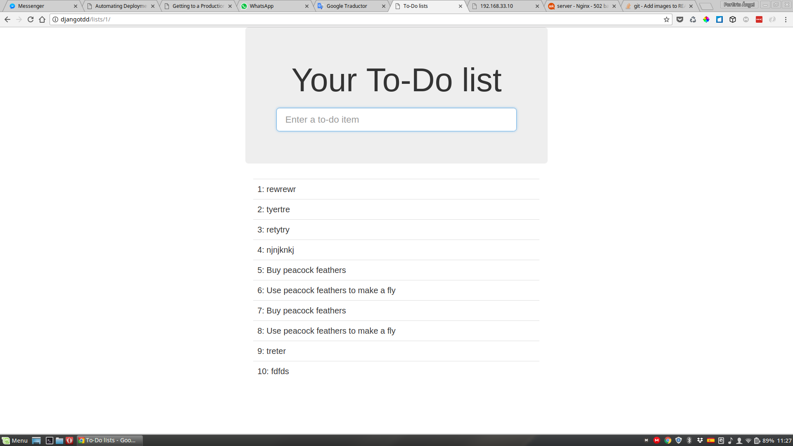

# DjangoTDD

Proyecto que utiliza la metodología TDD para desarrollar una aplicación con 
Django

## Instrucciones:

**1. Crear y activar un entorno virtual:**
```
virtualenv --python=/usr/bin/python3.5 venv
source venv/bin/activate
```

**2. Instalar las dependencias:**
```
pip3 install "django<1.12" "selenium<4"
pip install lettuce
pip install gunicorn
pip install whitenoise
```

## Correr proyecto:
```
python manage.py runserver 0.0.0.0:8000
``` 

## Ejecutar pruebas unitarias:
```
python manage.py test
```

## Ejecutar pruebas funcionales:
```
# Ejecución normal:
lettuce bdd/tests/

# Con stagin server_
STAGING_SERVER=djangotdd lettuce bdd/tests/
```

## Instalar nginx:
```
sudo apt-get update
sudo apt-get install systemd
sudo apt-get install nginx
sudo mv /lib/systemd/system/nginx.service /etc/systemd/system/nginx.service
sudo systemctl start nginx
```

## Instalar python 3.6:
```
sudo add-apt-repository ppa:fkrull/deadsnakes
sudo apt-get update
sudo apt-get install python3.6 python3.6-venv
```

## Configurar dns:
**Agregar el dominio a los hosts:**
```
sudo vim /etc/hosts
192.168.33.10   djangotdd
```

## Echar andar aplicación en el server:
```
# Deploy manual
gunicorn superlists.wsgi:application

# Deploy automático
fab deploy:host=elspeth@superlists.ottg.eu
```

